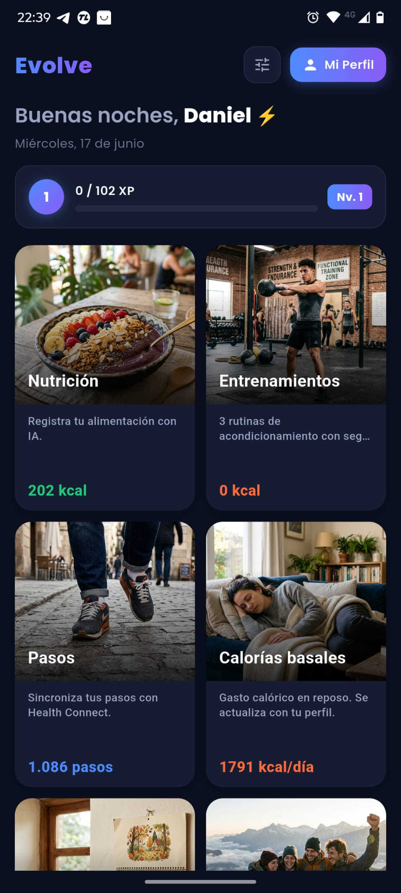
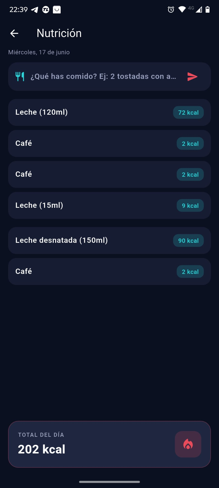
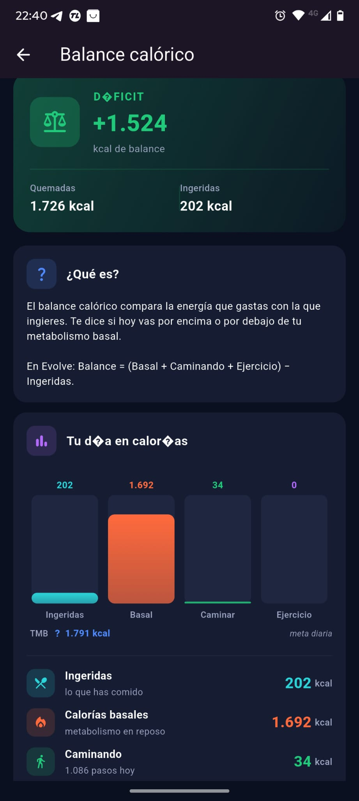
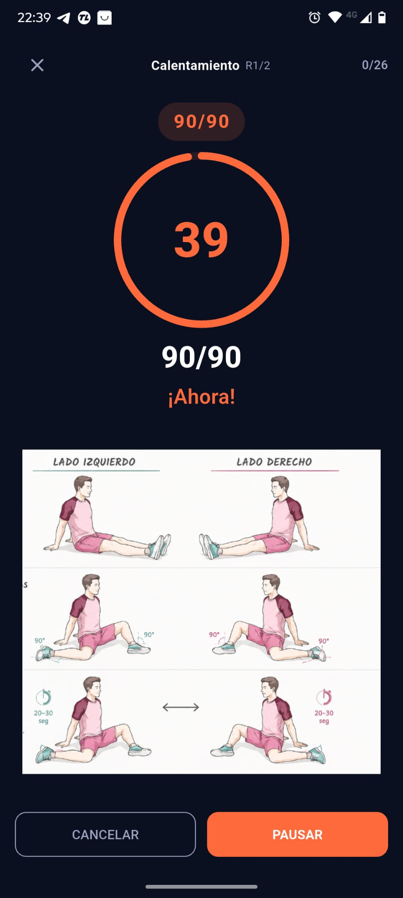
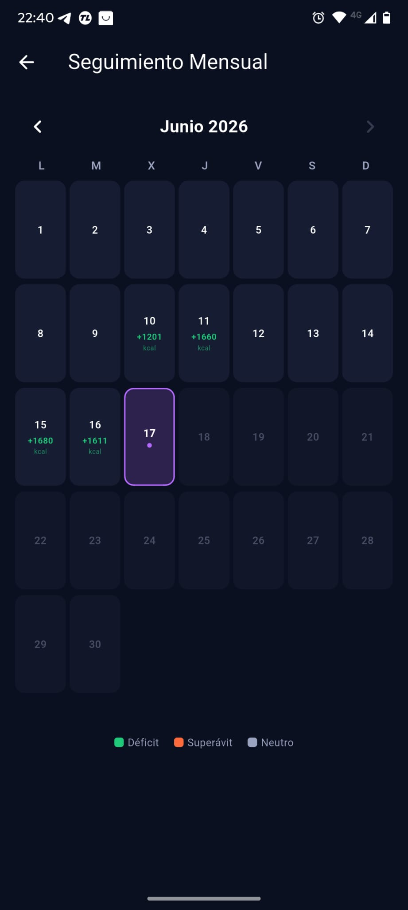
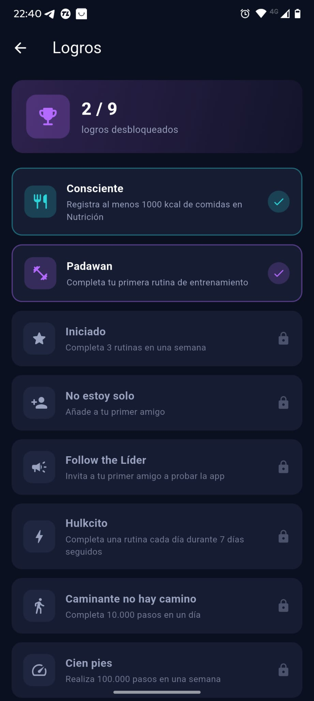
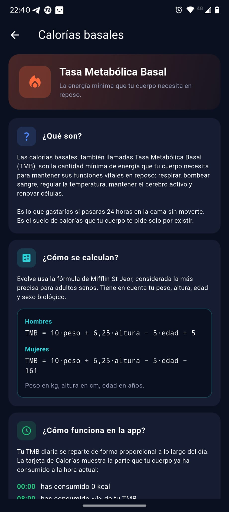

# Evolve

**Zure eboluzioa, zure erritmoa.**

[🇪🇸 Español](README-Español.md) • [🇬🇧 English](README-English.md) • [🇨🇦 Català](README-Català.md) • [🇪🇺 Euskera](README-Euskera.md) • [🇫🇷 Français](README-Français.md) • [🇩🇪 Deutsch](README-Deutsch.md) • [🇮🇹 Italiano](README-Italiano.md) • [🇳🇱 Nederlands](README-Nederlands.md) • [🇸🇦 العربية](README-Arabic.md)

Evolve fitness eta nutrizio aplikazio bat da, adimen artifiziala, gamifikazioa eta osasun-gailuekin sinkronizazioa konbinatzen dituena zure helburuak lortzen laguntzeko.

---

## Dashboard

---

## Zerk egiten du Evolve desberdin?

**Nutrizioa IArekin.** Deskribatu zer jan duzun hizkuntza naturalean eta IAk kaloriak kalkulatzen ditu berehala.

**Kaloria-balantza osoa.** Zure oinarrizko metabolismoa, oinez erretako kaloriak (Health Connect-ekin sinkronizatuak), entrenatzen erretakoak eta kontsumitutakoak kalkulatzen ditugu.

**Gidatutako entrenamenduak.** Kondizionamendu errutinak tenporizadorearekin, ariketa bakoitzaren irudiak eta soinu seinaleekin.

---

## Funtzionalitateak

- 🤖 **Nutrizioa IArekin** — Deskribatu zure janaria, IAk kaloriak esaten dizkizu
- 👟 **Pausoak Health Connect-ekin** — Sinkronizazio automatikoa
- 🔥 **Kaloria-balantza** — Kontsumituak vs erretakoak
- 🏋️ **Gidatutako errutinak** — Tenporizadorea, irudiak, soinuak
- 🎮 **Gamifikazioa** — XP, mailak eta lorpenak
- 📊 **Hileko jarraipena** — Egutegia zure kaloria-balantzarekin
- 🌍 **Hizkuntza anitz** — Euskera, Español, Català, English, Français, Deutsch, Italiano, Nederlands, العربية

---

## Pribatutasuna

[Pribatutasun politika](PRIVACY.md)

---

*Evolve — Zure eboluzioa, zure erritmoa.*

---

**Daniel Barrios-ek garatua** — Proiektu doakoa, garatzaile bakarrekoa. 🚀
